# TESTING

## Compatibility

In order to confirm the correct functionality, responsiveness, and appearance:

  - The website was tested on the following browsers: Chrome, Firefox, Safari.

  - Chrome:

  

  - FireFox:

  

  - Safari:

  

## Responsiveness

- The website was checked by devtools implemented in Firefox and Chrome browsers.

    - Chrome:

    

    - Firefox:

    

## Manual Testing

| Feature | Action | Expected Result | Tested | Passed | Comments |
|--------|--------|----------------|--------|--------|----------|
| Navbar | Click on the "Banner" | User is redirected to the homepage | Yes | Yes | - |
| Navbar | Click on the "Shop" link | User is redirected to the products page | Yes | Yes | - |
| Navbar | Click on the "Nutrition Plans" link | User is redirected to the plans page | Yes | Yes | - |
| Navbar | Click on the "Deals" link | User is redirected to the deals page | Yes | Yes | - |
| Navbar | Click on the "Clearance" link | User is redirected to the clearance page | Yes | Yes | - |
| Navbar | Click on the "New Arrivals" link | User is redirected to the new arrivals page | Yes | Yes | - |
| Navbar | Click on the Bag icon | User is redirected to the shopping bag page | Yes | Yes | - |
| Navbar | Click on Login/Register | User is redirected to authentication page | Yes | Yes | - |
| Homepage | - | - | - | - | - |
| Hero CTA | Click on "Shop Now" button | User is redirected to products page | Yes | Yes | - |
| Category cards | Click on category card | Products filtered by selected category | Yes | Yes | - |
| Product card | Click on product | Product detail page loads | Yes | Yes | - |
| Product page | - | - | - | - | - |
| Quantity input | Increase quantity | Quantity increases correctly | Yes | Yes | Minimum value is 1 |
| Add to Bag | Click "Add to Bag" | Product added to shopping bag | Yes | Yes | Success message displayed |
| Shopping Bag | - | - | - | - | - |
| View bag | Open shopping bag | Selected items displayed correctly | Yes | Yes | - |
| Update quantity | Change item quantity | Total price updates correctly | Yes | Yes | - |
| Remove item | Click remove button | Item removed from bag | Yes | Yes | - |
| Checkout button | Click checkout | User redirected to checkout page | Yes | Yes | - |
| Checkout | - | - | - | - | - |
| Full name input | Leave field empty | Error message displayed | Yes | Yes | Required field |
| Email input | Enter invalid email | Validation error shown | Yes | Yes | Email format validation |
| Address input | Enter delivery address | Address accepted | Yes | Yes | - |
| Empty bag checkout | Attempt checkout | Checkout prevented | Yes | Yes | Defensive design |
| Submit order | Complete checkout | Order confirmation displayed | Yes | Yes | - |
| Authentication | - | - | - | - | - |
| Register | Submit valid details | Account created successfully | Yes | Yes | - |
| Login | Submit valid credentials | User logged in successfully | Yes | Yes | - |
| Logout | Click logout | User logged out successfully | Yes | Yes | - |
| User Profile | - | - | - | - | - |
| Profile page | View profile | User details displayed | Yes | Yes | - |
| Order history | View past orders | Order history displayed | Yes | Yes | - |
| Admin | - | - | - | - | - |
| Admin login | Login as admin | Admin dashboard accessible | Yes | Yes | - |
| Add product | Create new product | Product visible on site | Yes | Yes | - |
| Edit product | Update product | Changes saved correctly | Yes | Yes | - |
| Delete product | Delete product | Product removed from site | Yes | Yes | - |

## Validator testing

  - ### CSS
    - No errors or warnings were found when passing through the official W3C validator.

    + **Profile.css**
        

    + **Checkout.css**
        

    + **Base.css**
        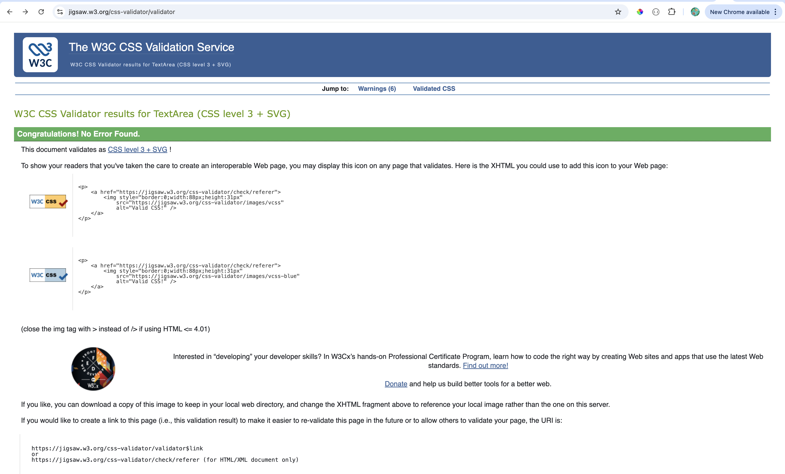

   - ### JS  
   *Note:The warnings thrown was because i was using an old version of JS Hint, there were no actual warnings*

   + **Checkout_js**
        

    + **Profile_js**
        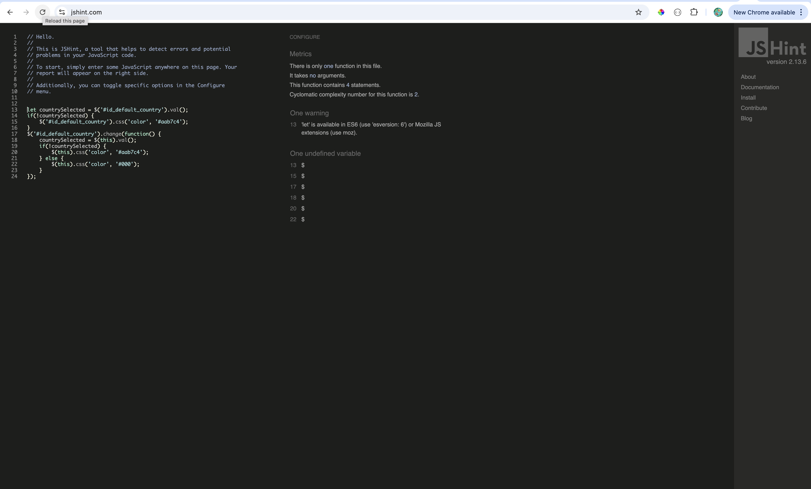

   - ### JSON  

   + **Categories.json**
        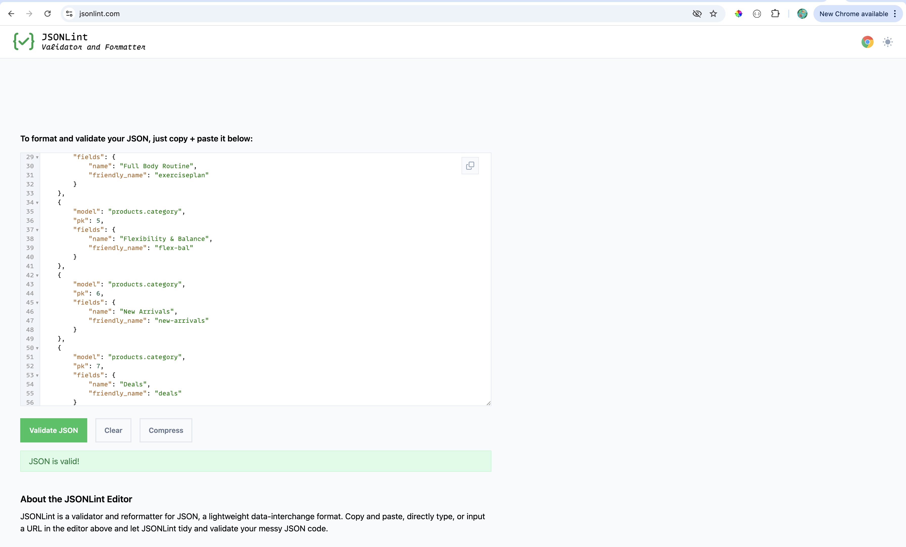

    + **Products.json**
        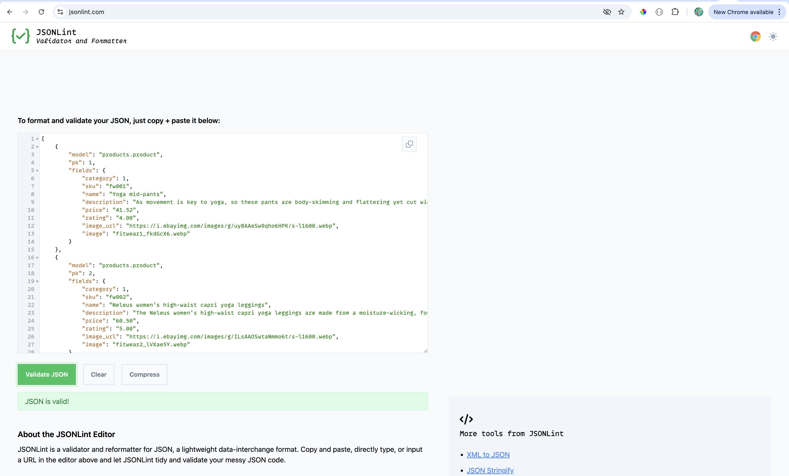

- ## LightHouse report
   
    - Using lighthouse in devtools I confirmed that the website is performing well, accessible and fonts chosen are readable.
    
  ### All Sections

  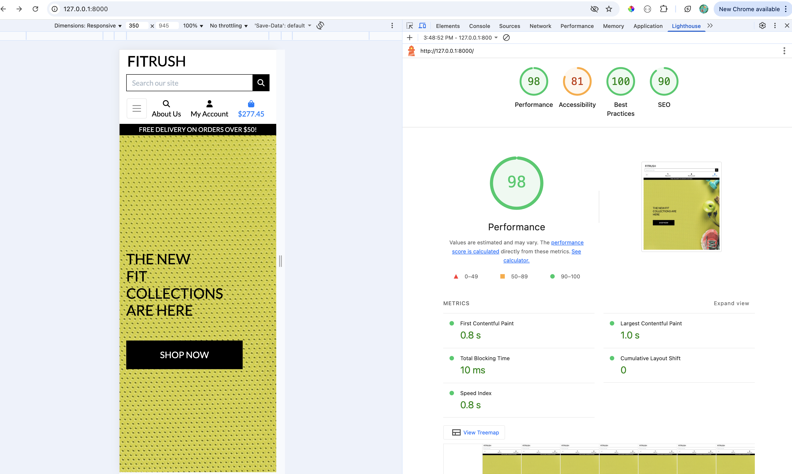

  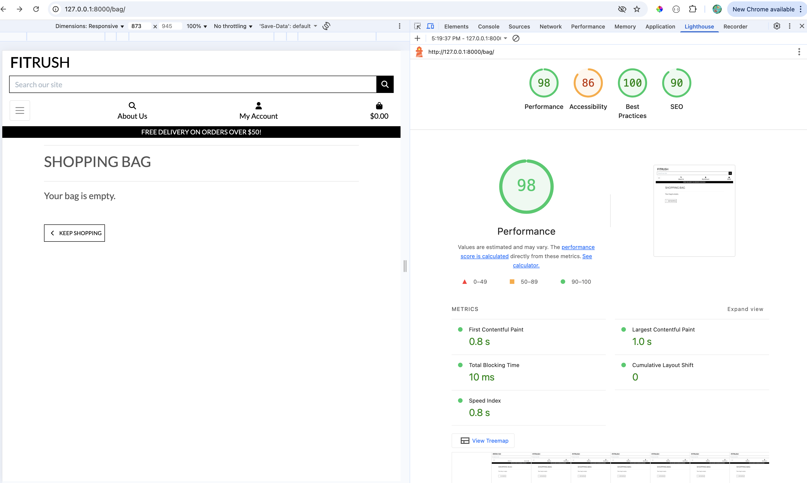

  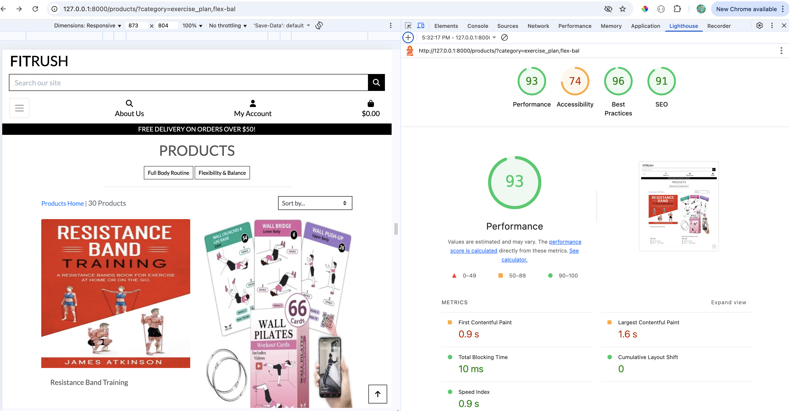

   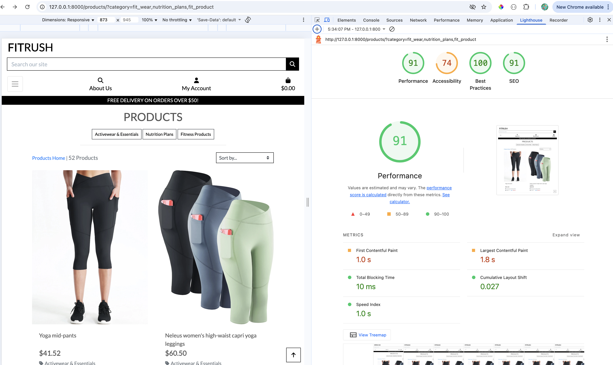

   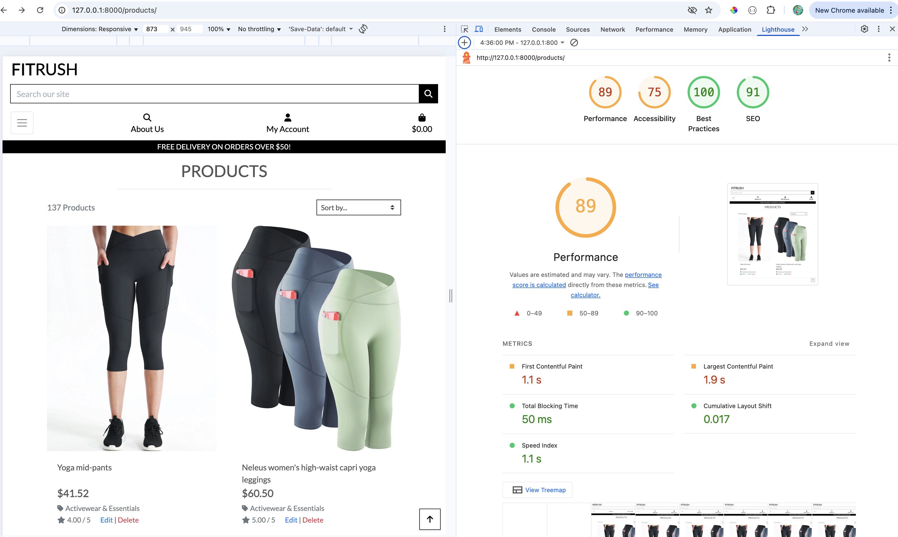

   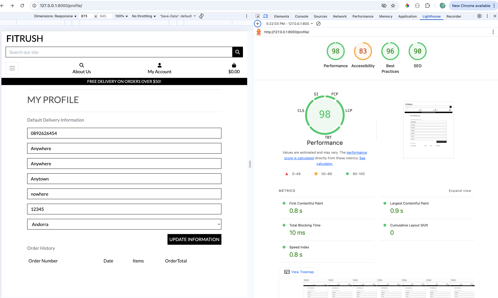

   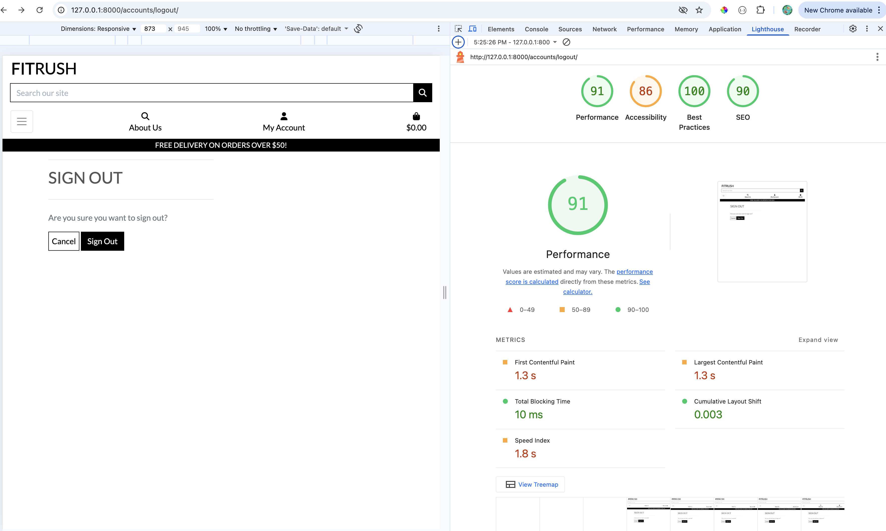

   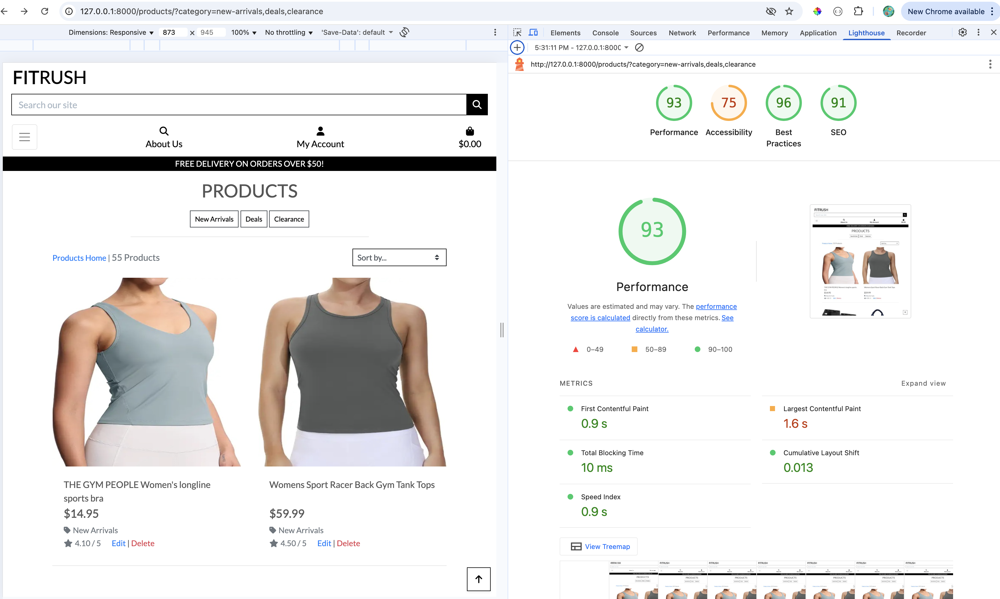

## Bugs

+ **Solved bugs**

### 1. The images were not showing on all pages which was due to broken link and has been fixed

### 2. 

### 3. 

### 4. 

### 5. 

+ **Unsolved bugs**
  - None
